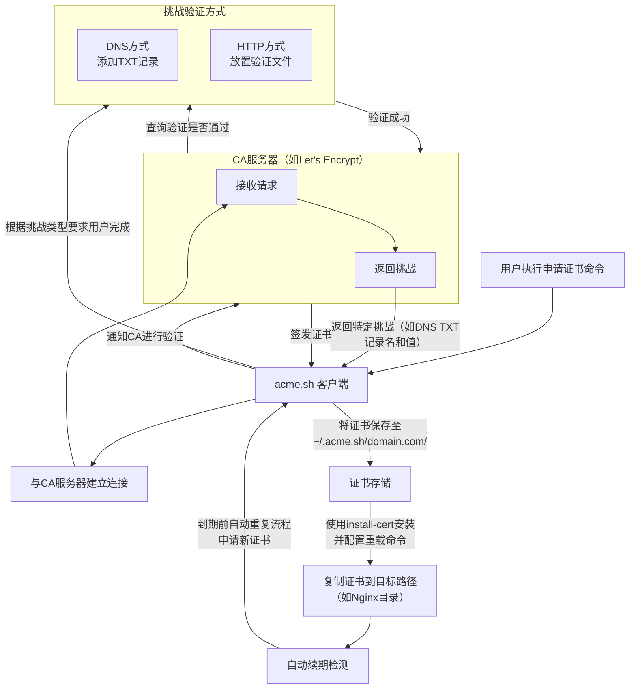

我们来深入解析一下 `acme.sh` 的工作原理。它不仅仅是一个简单的脚本，而是一个实现了 **ACME 协议** 的自动化客户端，其核心设计哲学是 **“Let's Encrypt”** 的延伸：**“自动化一切”**。

它的工作原理可以概括为以下几个核心阶段和概念：

---

### 🔍 一、核心目标：自动化证书管理
`acme.sh` 的核心目标是完全自动化 SSL/TLS 证书的**申请、验证、安装、更新**和**部署**整个生命周期，无需任何人工干预。

---

### 📡 二、核心协议：ACME
`acme.sh` 的工作完全基于 **ACME协议**。ACME 是 **“Automated Certificate Management Environment”** 的缩写，这是一个由 **Let‘s Encrypt** 推动并标准化的协议，专门用于证书的自动化管理。

ACME 协议定义了客户端（如 `acme.sh`）和证书颁发机构（CA，如 Let‘s Encrypt，ZeroSSL）之间如何进行通信来完成证书的申请和签发。

---

### 🔄 三、工作流程详解

下图清晰地展示了从账户注册到证书自动续期的完整工作流程，特别是关键的“挑战验证”环节：



#### 1. 账户注册（首次运行）
当你第一次使用 `acme.sh`（例如设置邮箱），它会为你向选定的 CA 创建一个 **ACME 账户**。这个过程通常会生成一对公私钥，公钥会被发送给 CA 服务器。这个账户用于后续所有操作的授权。

#### 2. 证书申请与域名验证（核心中的核心）
这是最关键的一步，即如何向 CA 证明 **“你拥有这个域名”**。`acme.sh` 支持多种验证方式，上图展示了最常用的两种：

*   **DNS 方式（最强大、最常用）**：
    *   **原理**：CA 要求你在域名的 DNS 解析中，添加一条特定的 **TXT 记录**。这条记录包含一个由你的账户私钥签名的令牌。
    *   **过程**：`acme.sh` 会根据 CA 的要求，生成这条 TXT 记录的名称和值。你既可以选择**手动**去域名运营商后台添加，更酷的是，如果你的 DNS 提供商（如阿里云、Cloudflare、GoDaddy 等）支持 API，`acme.sh` 可以**自动调用该 API** 来添加和后续删除这条记录（通过 `dns_ali`、`dns_cf` 等参数）。
    *   **优势**：可以申请**通配符证书**（`*.example.com`），用一个证书保护所有子域名。

*   **HTTP 方式（适用于Web服务器）**：
    *   **原理**：CA 要求你在网站的 `.well-known/acme-challenge/` 目录下，放置一个特定的验证文件。CA 服务器会通过 HTTP 访问这个文件的 URL 来验证。
    *   **过程**：`acme.sh` 会生成这个文件，并**临时启动一个 Web 服务器**（或利用已有的，如 Nginx）来提供这个文件。验证完成后，文件会被自动清理。
    *   **要求**：你的服务器必须已经可以通过公网 IP 的 80 端口访问。

#### 3. 证书签发与获取
一旦 CA 通过查询 DNS 或访问 HTTP 文件确认了你对域名的控制权，它就会立即为你**签发证书**。`acme.sh` 会从 CA 服务器获取到签发的证书文件（通常包括证书本身 `fullchain.cer` 和私钥 `domain.key`），并将其保存在 `~/.acme.sh/domain.com/` 目录下。

#### 4. 证书安装与部署
`acme.sh` 的一个重要理念是：**“不要直接使用 `~/.acme.sh/` 里的证书文件”**。
因为这些文件是它内部管理的，结构可能会变。你应该使用 `--install-cert` 命令：

```bash
acme.sh --install-cert -d example.com \
        --key-file       /path/to/your/nginx/key.pem  \
        --fullchain-file /path/to/your/nginx/cert.pem \
        --reloadcmd     "systemctl reload nginx"
```
这个命令会：
1.  将证书和私钥**复制**到你指定的路径（如 Nginx 或 Apache 的配置目录）。
2.  **记住**这个“安装配置”，包括目标路径和最重要的 `--reloadcmd`。

#### 5. 自动更新（真正的自动化）
这是 `acme.sh` 最省心的地方。
*   **定时任务**：安装时，`acme.sh` 会**自动创建一个 Cron 定时任务**（可以通过 `crontab -l` 查看）。这个任务**每天都会自动检查**所有已签发的证书是否即将到期（默认在到期前 **30 天** 开始尝试续期）。
*   **无缝更新**：当需要更新时，它会**完全自动地重复上述 2-4 步**：完成验证、获取新证书、将其安装到之前指定的路径，然后执行你预设的 `--reloadcmd`（如 `nginx -s reload`）来重载 Web 服务，使新证书生效。
*   **无中断服务**：Nginx 的重载命令是平滑的，不会中断现有连接。这意味着证书更新是**零停机**的。

---

### 💎 四、总结与核心特点

| 特点 | 原理体现 |
| :--- | :--- |
| **完全自动化** | 通过 Cron 任务自动检测和续期，配合 `--reloadcmd` 自动部署。 |
| **无依赖** | 整个工具由纯 Shell 脚本编写，不需要 Python 或其它外部解释器。 |
| **零停机** | 使用 `reload` 而不是 `restart` 来加载新证书，服务不中断。 |
| **安全** | 所有操作都在本地完成，你的域名私钥绝不会被发送给 CA。ACME 协议设计本身就保证了安全性。 |
| **强大灵活** | 支持大量的 DNS API，让你可以轻松管理通配符证书。 |

总而言之，**`acme.sh` 的原理就是作为一个高度智能化的 ACME 协议客户端，将复杂的证书申请、验证和部署流程全部封装起来，通过“失败-重试”机制和定时任务，最终实现“一次配置，终身免费”的自动化证书管理。**